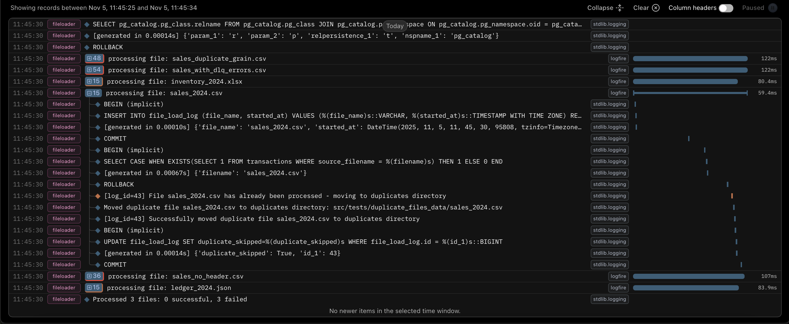

# FileLoader

An ETL framework for processing CSV, Excel, and JSON files with memory efficient processing, validation, staging, auditing, and database loading.

## Table of Contents

- [Features](#features)
- [Quick Start](#quick-start)
  - [Setup](#setup)
  - [Configuration](#configuration)
    - [Email Notifications](#email-notifications-optional)
    - [Slack Notifications](#slack-notifications-optional)
- [How It Works](#how-it-works)
  - [Initialization](#initialization)
  - [File Processing Pipeline](#file-processing-pipeline)
    - [Failure Notifications](#failure-notifications)
  - [Detailed Logging](#detailed-logging)
  - [Dead Letter Queue](#dead-letter-queue)
    - [DLQ Report](#dlq-report)
    - [DLQ Cleanup on Reprocessing](#dlq-cleanup-on-reprocessing)
  - [Quality / Audit Checks](#quality--audit-checks)
    - [Pydantic Model Validation](#pydantic-model-validation)
    - [Dataset Audits](#dataset-audits)
- [Logfire Integration](#logfire-integration)
- [How to Add a New Source](#how-to-add-a-new-source)
  - [Step 1: Create the System Directory (if new system)](#step-1-create-the-system-directory-if-new-system)
  - [Step 2: Create the Source File](#step-2-create-the-source-file)
  - [Step 3: Register the Source](#step-3-register-the-source)
  - [Required Fields](#required-fields)
  - [Optional Fields](#optional-fields)
  - [Format-Specific Fields](#format-specific-fields)
- [How to Add a New Reader](#how-to-add-a-new-reader)
  - [Step 1: Create the Reader Class](#step-1-create-the-reader-class)
  - [Required Methods](#required-methods)
  - [Step 2: Create Source Configuration](#step-2-create-source-configuration)
  - [Step 3: Register the Reader](#step-3-register-the-reader)
  - [Step 4: Use the Reader](#step-4-use-the-reader)


## Features

## Scalable

- **Multiple File Formats**: Supports CSV, Excel (`.xlsx`, `.xls`), and JSON files. Gzip compression is automatically detected and handled for CSV and JSON formats (e.g., `file.csv.gz`, `file.json.gz`)
- **Memory Efficient**: Uses iterative reading to handle large files without loading everything into memory
- **Database Batch Operations**: Database Operations are batched to handle large armounts of data
- **Parallel Processing**: Processes multiple files concurrently using thread pools
- **Flexible Database Support**: PostgreSQL, MySQL, and SQL Server Compatability
- **Proper Indexing**: Table indexing strategy that supports high data volumes
- **Portable/Flexible**: Dockerized deployment option for containerized execution or native installation using `uv`

## Reliable

- **Data Validation**: Pydantic model validation for each record
- **Write-Audit-Publish Pattern**: 
  - Writes data into a staging table
  - Audits the staging data
  - Publishes to target table
- **Automatic Grain Validation**: Automatic grain validation check based upon grain in config
- **Audit Framework**: Configurable aggregate audit queries to ensure data quality
- **Retry Logic**: Automatic retry with exponential backoff for database operations to handle transient failures
- **Error Isolation**: Errors in one file do not stop processing of other files - each file is processed independently with errors logged to `file_load_log` table and optional notification firing
- **Observability & Distributed Tracing**: Optional Logfire integration using spans to group logs together under each file process for easy observability
- **Notifications**: 
  - Email notifications to business stakeholders for file-based issues:
    - No Header detected
    - Missing required columns/fields
    - Record validation error threshold exceeded
    - Grain validation failed (duplicate grain values detected)
    - Dataset audits failed
    - Duplicate file detected (file already processed)
  - Slack notifications to Data Team for internal processing errors (code bugs, database failures) with detailed debugging information
- **File Management**: Automatic archiving and deletion after successful processing to keep directory clean

## Maintainable

- **Type-Safe Configuration**: Schema-validated file & repo configuration(s) using Pydantic models ensures correct setup and prevents configuration errors
- **Centralized Registry**: Single source of truth for all data source configurations via MASTER_REGISTRY - all file mappings and processing rules accessible in one place
- **Extensible Factory Pattern**: Uses a factory pattern with abstract base classes, making it easy to add new file format readers (e.g., `.txt`, `.parquet`)
- **Automatic Table Creation**: Database tables & indexes are automatically generated from Pydantic model schemas - no manual DDL required
- **Test Suite**: Comprehensive test coverage with pytest, fixtures, and isolated test configurations

## Quick Start

### Setup

The project utilizes `uv`

1. sync the packages using uv or the Make command
```bash
uv sync 
OR
make install
```
2. Install the pre-commit hooks (you might need to run `source .venv/bin/activate` if your uv environment is not being recognized)
```bash
pre-commit install --install-hooks
```

### Configuration

Set environment variables (Add the appropriate env prefix (DEV, TEST, PROD) - Ex. DEV_DATABASE_URL):

**Required:**
- `DATABASE_URL`: Database connection string (where to load the files)
- `DIRECTORY_PATH`: Directory to watch for files
- `ARCHIVE_PATH`: Directory to archive processed files
- `DUPLICATE_FILES_PATH`: Directory to move duplicate files (files that have already been processed)

### Email Notifications (Optional)
- `SMTP_HOST`: SMTP server hostname
- `SMTP_PORT`: SMTP server port (default: 587)
- `SMTP_USER`: SMTP username for authentication
- `SMTP_PASSWORD`: SMTP password for authentication
- `FROM_EMAIL`: Email address to send notifications from
- `DATA_TEAM_EMAIL`: Data team email address (always CC'd on failure notifications)

### Slack Notifications (Optional)
- `SLACK_WEBHOOK_URL`: Slack webhook URL for internal processing errors (code-based issues, not file validation problems)

### Batch Size (Optional)
- `BATCH_SIZE`: Number of records per batch insert (default: 10000)

### Logfire Logging (Optional)
- `LOGFIRE_TOKEN`: Logfire token to send logs to Logfire project

## How It Works

### Initialization

- **Automatic Table Creation**: On startup, automatically creates (IF NOT EXISTS) all target tables, indexes, and the `file_load_log` and `file_load_dlq` tables based on source configurations and Pydantic model schemas

### File Processing Pipeline

Legend:
 - 📧 = Step that when failed, sends email notifications to business stakeholders about file issue.

The system uses **parallel processing** with threads to handle multiple files concurrently. Below is the process for **an individual file**:

1. **File Discovery**: The file is discovered during a scan of the designated directory (`DIRECTORY_PATH`) for supported file types (CSV, Excel, JSON)

2. **Early Duplicate Detection** 📧: The system checks if this file has already been processed by querying the target table. If a duplicate is detected, the file is moved to the duplicates directory and processing is skipped (prevents accidental overwrites and directory clutter)

3. **Archive First**: The file is immediately copied to the archive directory before any processing begins (preserves original for recovery) - only for non-duplicate files

4. **Pattern Matching**: The file name is matched against source configurations using pattern matching to determine the processing rules

5. **Missing Header Detection** 📧: The file is checked for required headers/fields (CSV/Excel) or field presence (JSON). If the header is not there, processing fails.

6. **Missing Column Detection** 📧: The file is checked for all required columns/fields. If any are missing, processing fails.

7. **Dynamic Column Mapping**: Column names in the file are mapped using Pydantic field aliases to have database compatible names - supports flexible column naming in source files

8. **Column Pruning**: Unnecessary columns that aren't defined in the source model are automatically removed

9. **Iterative Row Processing**: Rows in the file are processed iteratively using generators for memory efficiency - handles large files without loading everything into memory

10. **Record Validation** 📧: Each record from the file is validated against the Pydantic model schema. Records that fail validation **do not** get inserted into the staging table. Instead, they are inserted into the Dead Letter Queue table. If the validation error threshold is exceeded, processing fails.

11. **Staging Table Creation**: A unique staging table (`stage_{filename}`) is automatically created for this file, enabling parallel processing of multiple files targeting the same destination table

12. **Chunked Inserts**: Validated records are inserted into the staging table in configurable batches (`BATCH_SIZE`) for memory efficiency (default 10,000). Records that failed validation are inserted into the `file_load_dql` table in batches.

13. **Unique Grain Check** 📧: Validates that grain columns (unique identifier columns) have unique values across all records in the staging table. If duplicates are detected, processing fails.

14. **Data Auditing** 📧: Configured audit queries are executed on the staging table. If any audit fails, processing fails.

15. **MERGE Operation**: Data from the staging table is merged into the target table based on grain columns, handling inserts and updates appropriately

16. **Dead Letter Queue Cleanup**: If this is a reprocessing run (DLQ records exist from a previous processing run for this file), all DLQ records for that filename are automatically deleted (in batches) after a successful merge. This keeps the DLQ table clean by removing records that have been successfully reprocessed.

17. **Cleanup**: The staging table is dropped and the original file is deleted from the directory. The archived copy remains for recovery if needed (simply move from archive back to directory to reprocess). If bad data got into the target table, then DELETE from the target table where `source_filename = {file_name}` and then reprocess.

**Note on Duplicate Files**: Files that have already been processed are detected early (step 2) and moved to the `DUPLICATE_FILES_PATH` directory. This prevents directory clutter and accidental data overwrites. To reprocess a duplicate file, first DELETE the existing records from the target table where `source_filename = {file_name}`, then move the file from the duplicates directory back to `DIRECTORY_PATH`.

17. **Failure Notifications**: 
    - **Email**: If `notification_emails` is configured for a source, email notifications are automatically sent to business owners when the process fails due to a file issue. The data team (configured via `DATA_TEAM_EMAIL`) is always CC'd for visibility. Notifications include relevant file info and sample validation errors when applicable.
    - **Slack**: Internal processing errors (code bugs, database connection failures, system exceptions) are automatically sent to Slack if `SLACK_WEBHOOK_URL` is configured. These are separate from file-related issues and include system information.

### Quality / Audit Checks

The system provides two levels of quality checks to ensure data integrity:

#### Pydantic Model Validation

Pydantic model validation provides field-level validation rules that are automatically applied to each record. You can implement various validation constraints in your Pydantic model:

- **String length**: Use `Field(max_length=100)` to limit the maximum length of string fields. Note: HIGHLY RECOMMEND you do this for all string fields if you use SQL Server, otherwise it implements NVARCHAR(MAX) for the data type with the table *yikes*
- **Min/Max values**: Use `Field(ge=0, le=100)` for numeric fields to enforce minimum and maximum values
- **Specific categories**: Use `Literal` types or `Field` constraints to restrict values to specific allowed categories
- **Type validation**: Automatic type checking (int, float, date, datetime, etc.) with proper parsing and conversion. Supports Pendulum date/datetime types via `pydantic-extra-types[pendulum]` for enhanced date handling
- **Required fields**: All fields in the Pydantic model must exist as columns in the file (both required and optional fields). Fields without `Optional` are required to have a value in each record. Optional fields can have missing/null values in records. During record validation, Pydantic will fail if a required field has a missing/null value in a record
- **Custom validators**: Implement custom validation logic using Pydantic validators for complex business rules

Records that fail validation are automatically inserted into the Dead Letter Queue (`file_load_dlq`) table with detailed error information, including the column name, invalid value, error type, and error message. If the validation error threshold is exceeded (configured via `validation_error_threshold`), the entire file processing fails and an email notification is sent to business stakeholders.

#### Dataset Audits

Dataset audits provide holistic checks across the entire dataset using SQL queries defined in the `audit_query` configuration. These audits run after all records are inserted into the staging table and validate data quality at the dataset level rather than individual records.

Audit queries should:
- Use the `{table}` placeholder which will be replaced with the staging table name
- Return an aggregate CASE statement that evaluates to `1` for success and `0` for failure
- Check business rules, data quality metrics, or dataset-level constraints
- Return *only one* row.

Example audit queries:
- Aggregate value checks (e.g., total sales amount within expected range)
- Business rule validations (e.g., date ranges valid)

Example Query (sale_date records have to be within the last 30 days and total sales amount has to be less than on million dollars)
```sql
SELECT
CASE 
  WHEN SUM(
    CASE WHEN sale_date BETWEEN DATEADD(day, -30, GETDATE()) AND GETDATE() THEN 1 ELSE 0 END
    ) = COUNT(*) THEN 1 ELSE 0 END AS sale_date_within_last_30_days,
CASE WHEN SUM(sale_amount) < 1000000 THEN 1 ELSE 0 END AS sales_under_one_million
FROM {table}
```

If any audit query fails, the merge step is skipped, the file processing is marked as failed, and an email notification is sent to business stakeholders with audit failure details.

### Detailed Logging

The `file_load_log` table automatically tracks detailed metrics for every file processing run:

- **Duplicate Skipped**: Tracking duplicates that are skipped
- **File Archive Phase**: Archive success/failure status, start/end timestamps
- **Processing Phase**: Records processed count, validation errors count, start/end timestamps
- **Staging Phase**: Records loaded into staging table count, start/end timestamps
- **Audit Phase**: Audit success/failure status, start/end timestamps
  - This phase's first step is automatic grain validation, then the provided audit query
- **Merge Phase**: Records inserted/updated in target table counts, start/end timestamps
- **Overall Status**: Success/failure status for the entire run, start/end timestamps, exception error type

All metrics are logged automatically throughout the process, providing complete visibility into each stage of the ETL pipeline.

>Note: The Processing and Staging phases timeframes overlap because they are iterators chained together. So they  are effectively operating at the same time in a stream. Adding up the individual timeframes of the phases will not equal the overall time frame (`started_at`, `ended_at`), which accurately tracks the whole process.

### Dead Letter Queue

The `file_load_dlq` automatically captures all records that fail validation during file processing:

- **`id`**: Auto-incrementing primary key
- **`source_filename`**: The name of the source file
- **`file_row_number`**: The row number in the source file where the error occurred
- **`file_record_data`**: Contains only the relevant fields from the failed record in JSON:
  - Fields that failed validation
  - Grain fields (identifiers) for record identification
- **`validation_errors`**: Formatted validation error messages as JSON, containing:
  - `column_name`: The field name that failed validation (source file column name)
  - `column_value`: The invalid value that was provided
  - `error_type`: The type of validation error (e.g., `int_parsing`, `date_parsing`)
  - `error_msg`: The error message (lowercased)
  - Multiple errors are formatted as an array: `[{column_name: quantity, column_value: not_a_number, error_type: int_parsing, error_msg: ...}, ...]`
- **`file_load_log_id`**: Foreign key reference to `file_load_log.id` for tracking which processing run this error belongs to
- **`target_table_name`**: The target table name this record was intended for
- **`failed_at`**: Timestamp when the record failed validation

The table includes indexes on `file_load_log_id` and `source_filename` for efficient querying.

#### DLQ Report

I recommend creating an accessible report off of the Dead Letter Queue table so that business stakeholders can see validation errors and fix them without any intervention. Utilize the below pattern for efficiency if possible:
```SQL
;WITH CTE AS (
  SELECT
  id
  FROM file_load_dlq
  WHERE source_filename = {selected file name}
)
SELECT
dlq.file_row_number,
dlq.file_record_data,
dlq.validation_errors,
dlq.failed_at
FROM file_load_dlq AS dlq
INNER JOIN CTE
  ON CTE.id = dlq.id
ORDER BY file_row_number
```

#### DLQ Cleanup on Reprocessing

When a file is reprocessed and the merge succeeds, the system automatically detects if DLQ records exist from a previous processing run. If they do, all DLQ records for that filename are deleted to keep the DLQ table clean. This ensures that successfully reprocessed records don't clutter the DLQ table.

## Logfire Integration

Logfire provides distributed tracing and observability for file processing operations. When enabled, each file processing operation is wrapped in a span that automatically associates all logs with that specific file, making it easy to trace logs and debug issues.



### How It Works

When `{DEV|TEST|PROD}_LOGFIRE_TOKEN` is configured:
- Each file processing operation creates a span named after the file being processed
- All logs generated during file processing are automatically associated with that span
- SQLAlchemy engine logs are captured separately at INFO level
- Application logs are sent to Logfire at DEBUG level (development) or INFO level (production)

This allows you to:
- View all logs for a specific file processing run in one place
- Trace the complete lifecycle of a file from start to finish
- Debug issues by correlating logs with specific file operations
- Monitor performance and identify bottlenecks

The system gracefully falls back to console-only logging if `LOGFIRE_TOKEN` is not provided, so Logfire is completely optional. You can create a [free account](https://logfire-us.pydantic.dev) to get 1,000,000 requests per month though.

> Hint: Disable the sqlalchemy.engine logging and you'd stay below the one million requests per month threshold for a LONG time.

## How to Add a New Source

Adding a new data source involves creating a Pydantic model and source configuration, then registering it in the master registry.

The system will automatically:
- Create the database table on startup
- Match files using the `file_pattern`
- Validate and load data according to your configuration

### Step 1: Create the System Directory (if new system)

Create a new directory under `src/sources/systems/{system_name}/`:

```bash
mkdir -p src/sources/systems/{system_name}
```

### Step 2: Create the Source File

Create `{source_file}.py` in the new directory with:

1. **Pydantic Model**: Define your table schema by extending `TableModel`:
   ```python
   from src.sources.base import CSVSource, TableModel
   from pydantic_extra_types.pendulum_dt import Date
   from pydantic import Field
   
   class YourModel(TableModel):
       field1: str = Field(alias="Column Name")  # Use alias if column names differ
       field2: int
       field3: Date
   ```

2. **Source Configuration**: Create a source instance (CSVSource, ExcelSource, or JSONSource):
   ```python
   YOUR_SOURCE = CSVSource(
       file_pattern="files_*.csv",           # Wildcard pattern to match files
       source_model=YourModel,                # Pydantic model defined above
       table_name="your_table",               # Database table name
       grain=["field1", "field2"],            # Unique key columns (for MERGE)
       audit_query="""                        # SQL audit query (must return 1=success, 0=failure)
           SELECT CASE WHEN COUNT(DISTINCT field1) = COUNT(*) THEN 1 ELSE 0 END AS grain_unique
           FROM {table}
       """,
       validation_error_threshold=0.05,      # Optional: % errors allowed (default: 0.0)
       delimiter=",",                         # CSV-specific
       encoding="utf-8",                      # CSV-specific
       skip_rows=0,                           # Rows to skip at start
   )
   ```

### Step 3: Register the Source

Import and register your source in `src/sources/systems/master.py`:

```python
from src.sources.systems.{system_name}.{system_name} import YOUR_SOURCE

MASTER_REGISTRY.add_sources([YOUR_SOURCE])
```

### Required Fields

All sources require:
- `file_pattern`: Wildcard pattern (e.g., `"sales_*.csv"`) to match file names
- `source_model`: Pydantic model class extending `TableModel`
- `table_name`: Database table name where data will be loaded
- `grain`: List of column names that form the unique key (used for MERGE operations)
- `audit_query`: SQL query with `{table}` placeholder that returns CASE statements (1=success, 0=failure)
- `validation_error_threshold`: Float (default: 0.0) - maximum allowed error rate

### Optional Fields

- `notification_emails`: List of email addresses (e.g., `["owner@company.com", "team@company.com"]`) to notify when files fail. If configured, notifications are sent for:
  - Missing header detected (no headers found in file)
  - Missing required columns/fields (file is missing expected columns)
  - Validation threshold exceeded (too many validation errors)
  - Audit failures (data quality checks failed)
  - Duplicate file detected (file has already been processed)
  - The data team (configured via `DATA_TEAM_EMAIL` setting) is always CC'd for visibility

### Format-Specific Fields

**CSVSource**:
- `delimiter`: Field delimiter (default: ",")
- `encoding`: File encoding (default: "utf-8")
- `skip_rows`: Number of rows to skip (default: 0)

**ExcelSource**:
- `sheet_name`: Sheet name (optional, uses first sheet if None)
- `skip_rows`: Number of rows to skip (default: 0)

**JSONSource**:
- `array_path`: JSONPath to array items (default: "item")
- `skip_rows`: Number of items to skip (default: 0)

## How to Add a New Reader

Adding support for a new file format (e.g., `.txt`, `.parquet`, `.xml`) involves creating a reader class and a source configuration class, then registering the reader with the factory.

### Step 1: Create the Reader Class

Create a new file `src/readers/{format}_reader.py` extending `BaseReader`:

```python
from pathlib import Path
from typing import Any, Dict, Iterator

from src.readers.base_reader import BaseReader
from src.sources.base import TXTSource  # Your custom source class


class TXTReader(BaseReader):
    def __init__(self, file_path: Path, source: TXTSource, delimiter: str, skip_rows: int):
        super().__init__(file_path, source)
        self.delimiter = delimiter  # From Source Config
        self.skip_rows = skip_rows  # From Source Config

    def read(self) -> Iterator[Dict[str, Any]]:
        """Read file iteratively, yielding dict records."""
        # Validate headers/fields using self._validate_fields(actual_fields)
        # Yield records as dictionaries
        pass

    @classmethod
    def matches_source_type(cls, source_type) -> bool:
        """Return True if source_type matches this reader's source class."""
        return source_type == TXTSource
```

### Required Methods

**`__init__`**:
- Must accept `file_path: Path` and `source: DataSource`
- Must call `super().__init__(file_path, source)`
- Accept any reader-specific parameters needed

**`read()`**:
- Must return `Iterator[Dict[str, Any]]`
- Should validate fields using `self._validate_fields(actual_fields)` where `actual_fields` is a `set[str]` of field names
- Should yield records as dictionaries where keys match Pydantic model field names or aliases
- Should respect `self.skip_rows` if applicable

**`matches_source_type()`**:
- Classmethod that returns `True` if the source type matches this reader
- Used by `ReaderFactory` to validate source/reader compatibility

### Step 2: Create Source Configuration

Create a new source class in `src/sources/base.py` extending `DataSource` with reader-specific configuration fields:

```python
class TXTSource(DataSource):
    delimiter: str = Field(default="|")
    skip_rows: int = Field(default=0)
```

### Step 3: Register the Reader

Add your reader to `src/readers/reader_factory.py`:

1. **Import the reader**:
   ```python
   from src.readers.txt_reader import TXTReader
   ```

2. **Add to `_readers` dictionary**:
   ```python
   _readers = {
       ".csv": CSVReader,
       ".xlsx": ExcelReader,
       ".xls": ExcelReader,
       ".json": JSONReader,
       ".txt": TXTReader,  # Add your reader
   }
   ```

3. **Update `include` set** (if you added new source fields):
   ```python
   reader_kwargs = source.model_dump(
       include={"delimiter", "encoding", "skip_rows", "sheet_name", "array_path", "your_new_field"}
   )
   ```

### Step 4: Use the Reader

Once registered, create a source configuration using your new source type and the system will automatically use your reader for matching file extensions.